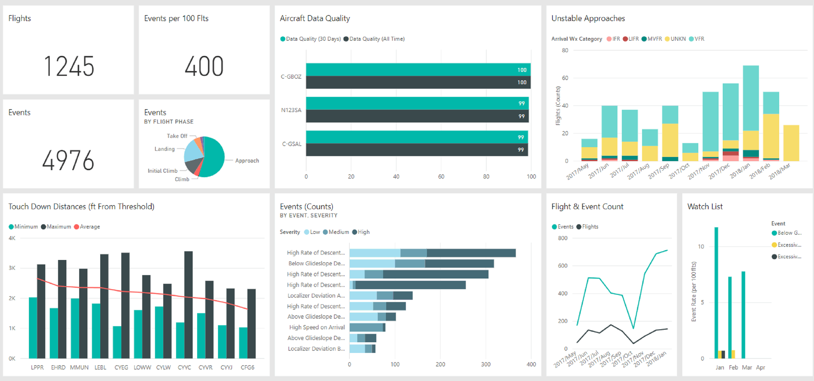
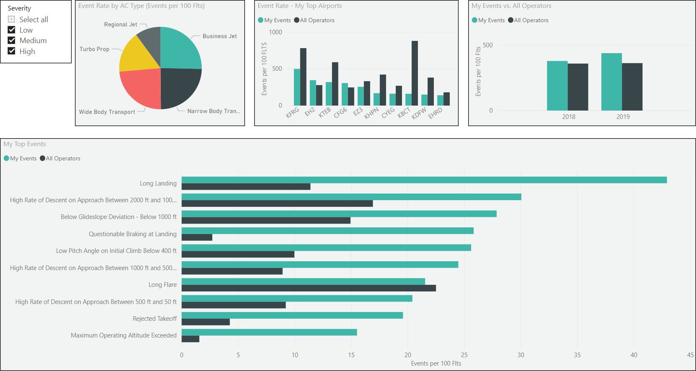

<h1 align = 'center'> Analyzing and Extracting Insights from US Department of Transportation Flights Data: A Comprehensive Data Exploration Project </h1>

  

  

  

  

In this professional project, I undertook the task of exploring a real-world dataset sourced from the US Department of Transportation. With a focus on flights data, our objective is to conduct a thorough analysis and extract meaningful insights from the dataset. By employing various data exploration techniques and methodologies, we aim to uncover patterns, trends, and relationships within the data. Through this comprehensive exploration, we aspire to gain valuable knowledge about the factors influencing flight operations, performance metrics, delays, and other key aspects of air travel. This project serves as a platform for enhancing our understanding of the aviation industry and provides a valuable opportunity to leverage data-driven insights for informed decision-making and strategic planning.
